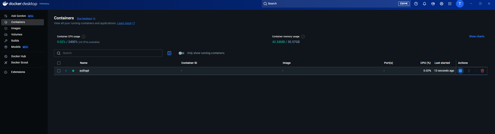
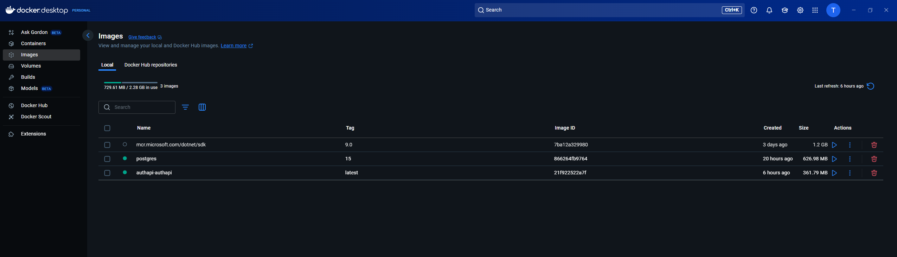
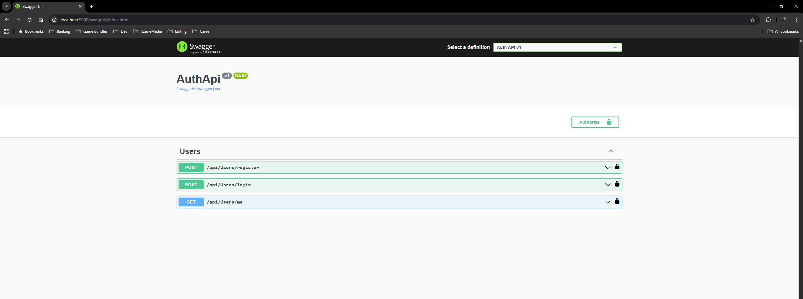
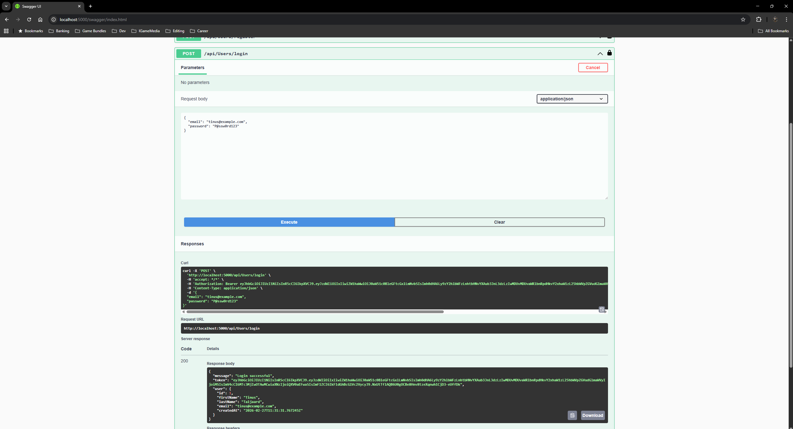
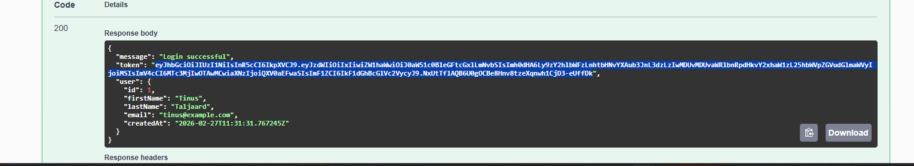
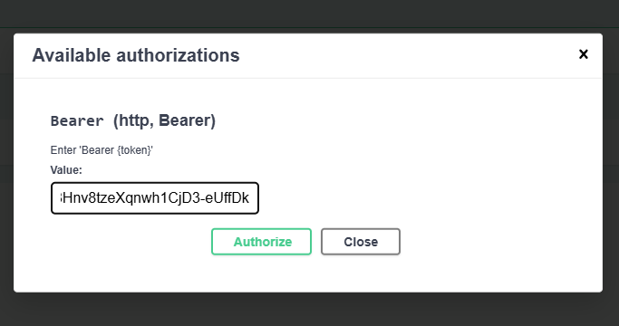
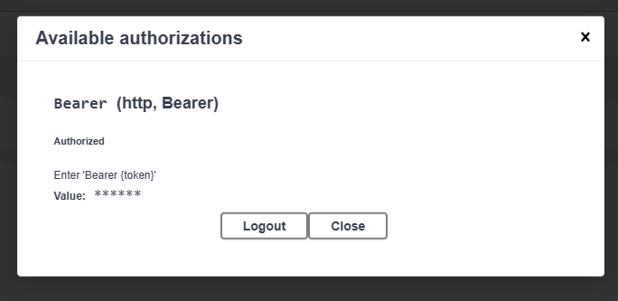
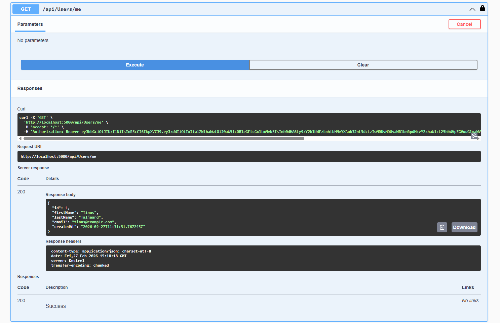

# Authenticator - Backend API

A .NET Core authentication API using JWT, BCrypt, PostgreSQL, Docker, and EF Core.

## Overview

This API provides user authentication functionality, including:

- User registration
- User login
- Retrieving authenticated user details

The API is secured using **JWT tokens**, and passwords are hashed using **BCrypt**. It uses **Entity Framework Core** for database access and **PostgreSQL** as the database. The entire solution runs inside Docker containers for easy deployment.

## Features

- Register a user with first name, last name, email, and password
- Login with email and password
- Retrieve user details (authenticated only)
- Unit and integration tests included
- Fully containerized using Docker and Docker Compose

## Getting Started

### Prerequisites

- [Docker](https://www.docker.com/get-started)
- [.NET 9 SDK](https://dotnet.microsoft.com/en-us/download/dotnet/9.0) (for development outside Docker, optional)

### Running the Application

1. Clone the repository:
git clone https://github.com/YOUR_USERNAME/authenticator-api.git
cd authenticator-api

2. Start the API and PostgreSQL containers using Docker Compose:
docker-compose up -d --build

3. Verify the containers are running:
docker ps

4. Access Swagger to test endpoints
http://localhost:5000/swagger/index.html

Database Migrations

The database is automatically migrated when the API starts inside the container.
For local development with the .NET SDK:

dotnet ef database update --project AuthApi/AuthApi.csproj

API Endpoints
Endpoint	Method	Description	Auth Required
/api/auth/register	POST	Register a new user	No
/api/auth/login	POST	Authenticate a user	No
/api/auth/me	GET	Get details of the authenticated user

Testing:
Unit and integration tests are included in the AuthApi.Tests project.
Run tests locally:
dotnet test AuthApi.Tests/AuthApi.Tests.csproj --settings tests.runsettings

License

This project is licensed under the MIT License.

## Screenshots

### Docker Environment

### Swagger API

